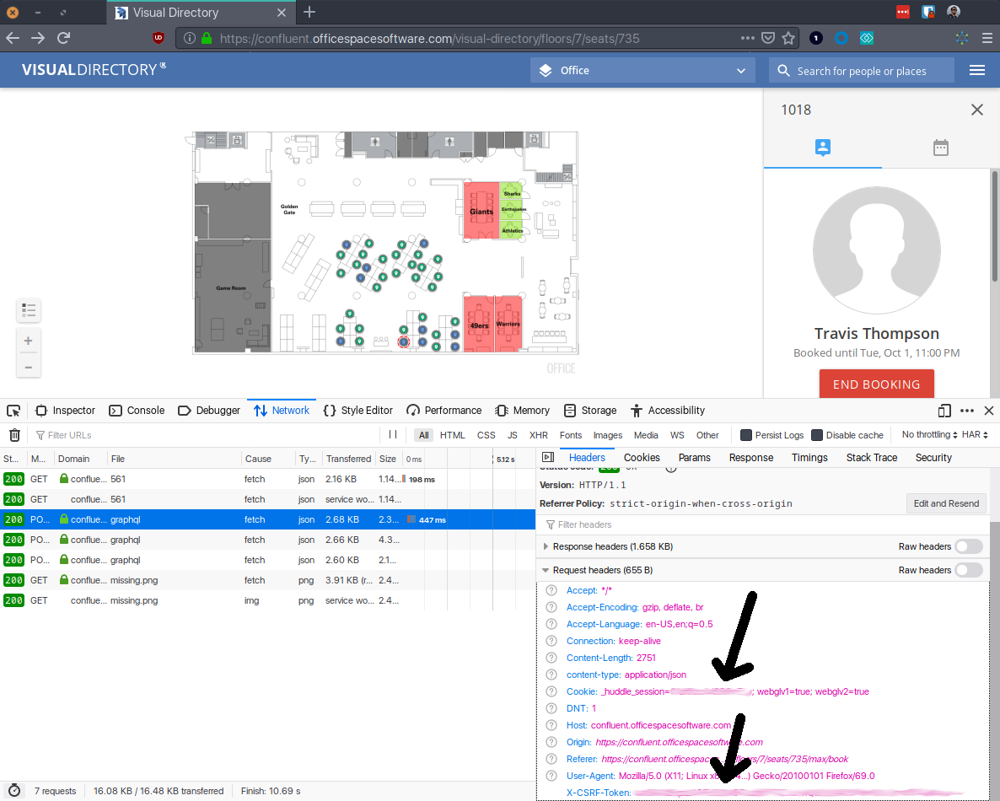

# OfficeSpace desk booker script

## Usage
```
→ go run main.go -h
Usage of /tmp/go-build697668133/b001/exe/main:
  -csrfToken string
    	OfficeSpace 'X-CSRF-Token' header.  Default $OS_CSRF_TOKEN. (default "")
  -daysToBook int
    	Number of days out to book, including today. (default 10)
  -employeeId string
    	Employee ID from OfficeSpace.  Default $OS_EMPLOYEE_ID. (default "")
  -huddleSession string
    	OfficeSpace '_huddle_session' cookie.  Default $OS_HUDDLE_SESSION. (default "")
  -seatId string
    	Seat ID from OfficeSpace.  Default $OS_SEAT_ID. (default "")
exit status 2
```

You can also set these varibles via shell variables
```
OS_HUDDLE_SESSION=
OS_EMPLOYEE_ID=
OS_CSRF_TOLKEN=
OS_SEAT_ID=
```

### Where do I get this information?

Navigate to OfficeSpace in Okta, pick the desk you want to book, and open up the network console:


Then book the desk, you'll need to grab a cookie, a header, and 2 variables from the payload sent.




## Example

```
→ go run main.go
Attempting to book seat 735 for 10 days
Attempting to book day 0 (2019-10-01)... Failed. Error booking desk: employeeAlreadySeated
Attempting to book day 1 (2019-10-02)... Failed. Error booking desk: employeeAlreadySeated
Attempting to book day 2 (2019-10-03)... Failed. Error booking desk: employeeAlreadySeated
Attempting to book day 3 (2019-10-04)... Failed. Error booking desk: employeeAlreadySeated
Attempting to book day 4 (2019-10-05)... Success. [#95] You should receive a booking confirmation email shortly.
Attempting to book day 5 (2019-10-06)... Success. [#96] You should receive a booking confirmation email shortly.
Attempting to book day 6 (2019-10-07)... Success. [#97] You should receive a booking confirmation email shortly.
Attempting to book day 7 (2019-10-08)... Success. [#98] You should receive a booking confirmation email shortly.
Attempting to book day 8 (2019-10-09)... Failed. Error booking desk: invalidPeriod
Attempting to book day 9 (2019-10-10)... Failed. Error booking desk: invalidPeriod
```
